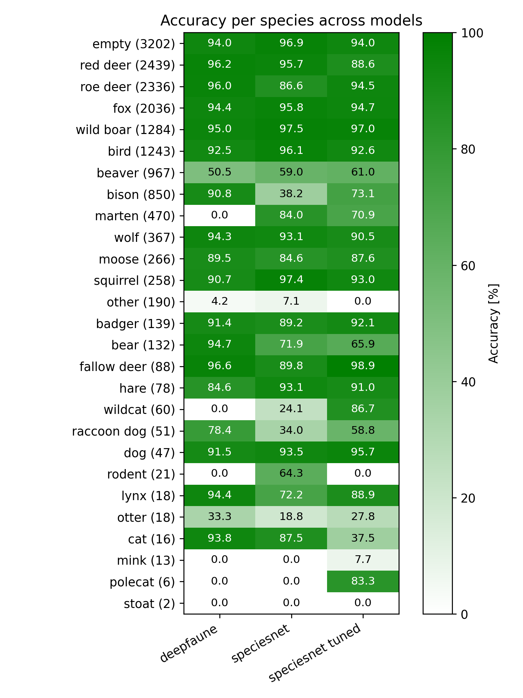

This is a repository with code used in the "Comparing and fine-tuning animals images classification models for polish species" research.

An app using the fine-tuned DeepFaune model is also [available here](https://github.com/PLKplkPLK/animal_classification_app)

### Results

### The code
To run base Speciesnet and Deepfaune models you can use `speciesnet/run_speciesnet.ipynb` and `deepfaune/run_deepfaune.ipynb` notebooks.

Fine tuning notebooks can be found in `fine_tuning` directory.

The pipeline of data preparation, fine tuning and model evaluation can be seen in numbered notebooks: `0_data_cleaning.ipynb`, `1_run_megadetector.ipynb`, instead of `2_train_model.ipynb` I'd recommend to see notebooks in the `fine_tuning` directory, `3_run_model.ipynb` and `4_statistics_plots.ipynb`
